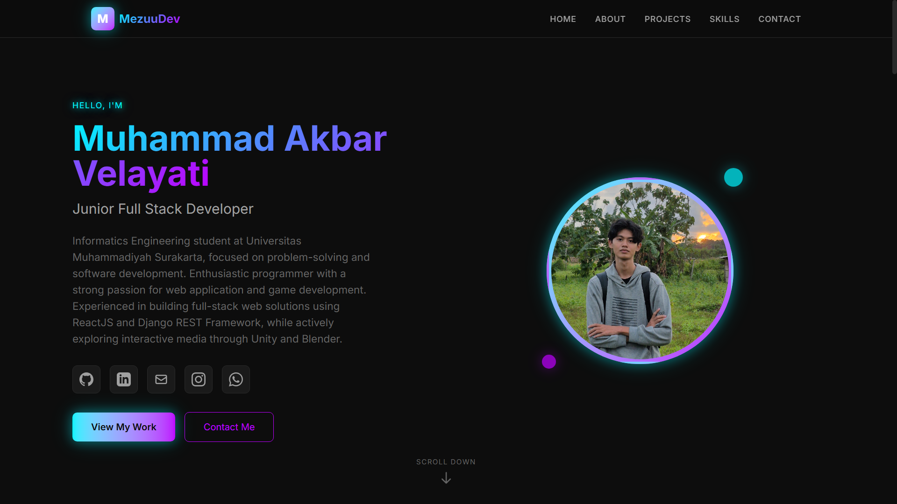

# Portfolio Website

##  Overview

A personal portfolio website built to showcase my projects, skills, and professional journey. Designed with a focus on modern aesthetics, responsiveness, and seamless user experience.


https://mezuu-portofolio.vercel.app/

## Tech Stack

This project is built using the following technologies:

- **[React](https://react.dev/)**: JavaScript library for building user interfaces.
- **[TypeScript](https://www.typescriptlang.org/)**: Typed superset of JavaScript for better code quality.
- **[Vite](https://vitejs.dev/)**: Next Generation Frontend Tooling.
- **[Tailwind CSS](https://tailwindcss.com/)**: A utility-first CSS framework for rapid UI development.

## Features

- **Hero Logic**: Introduction and brief bio.
- **About Me**: Detailed professional background.
- **Tech Stack**: Showcase of skills and technologies.
- **Projects**: Gallery of featured work with descriptions.
- **Contact**: Easy ways to get in touch.

##  Installation

To get a local copy up and running, follow these simple steps:

1.  **Clone the repository**
    ```bash
    git clone https://github.com/mezuuu/Portofolio.git
    cd portfolio-vite
    ```

2.  **Install dependencies**
    ```bash
    npm install
    ```

3.  **Start the development server**
    ```bash
    npm run dev
    ```

## 📜 Scripts

- `npm run dev`: Starts the development server.
- `npm run build`: Builds the app for production.
- `npm run lint`: Runs ESLint to check for code quality issues.
- `npm run preview`: Previews the production build locally.

---

Made with Vite + React & Tailwind CSS by [Mezuuu](https://github.com/mezuuu)
